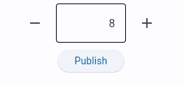
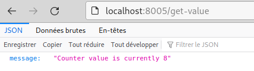

# Using Flet with FastAPI: thoughts and example

Recently I've checked out the new feature on how to to run serve Flet Apps using FastAPI and i must say it's really nice and it can be a game-changer for API applications requiring a user interface such as micro-services.

Here is why:

- It is now possible to implement and run both the front end  (Flet) and the back end (FastAPI) in the same project. It's still  possible to clearly separate both of them.
- Using this approach, the Flet code is running on the server while the browser is only displaying and processing the events. This has some benefits because the Flet App can communicate directly with  FastAPI using function calls and without going through HTTP requests (In the past i tried to make HTTP requests from Pyodide but without  success).
- The API endpoint functions can be registered using a decorator and to passed over as a dictionary to the Flet App, which enables the Flet App to perform calls to the API while being defined in sub-package.
- It's also fairly simple to add loop functions to each instance of the Flet App (opened window) or to the API whenever needed. All of this only using async (no separate thread nor child process).


To illustrate this, a traditional "counter app" is available: https://github.com/flokapi/flet-fastapi-example/tree/main/apps/counter

The this app provides a counter which increments itself automatically using a loop function. 



When the `Publish` button is pressed, the value of the counter will be set in the API. This value can be accessed using an HTTP request to the API.



## The Code

### Accessing to API functions from the Flet GUI

Each function used by the API can be registered using the  `@api.register` decorator

```python
@api.register
@app.get('/set-value')
async def set_value(value: int):
    global counter
    counter = value
    return {'message': f'Updated counter value to {value}'}
```

`api.get()` will then produce a dictionary of functions which is passed over to the Flet GUI when creating it.

The Flet app can then save the API functions dictionary as an attribute and make a call to the API whenever needed.

```python
await self.api['set_value'](30)
```

This is equivalent to `http://localhost:8005/set-value?value=30`


### Serving a Flet App from FastAPI

```python
@asynccontextmanager
async def lifespan(app: FastAPI):
    await flet_fastapi.app_manager.start()
    yield
    await flet_fastapi.app_manager.shutdown()


async def main(page: ft.Page):
    await gui.init(page, cfg, api.get())

app.mount('/', flet_fastapi.app(main))
```


### Loop functions

The code also shows how to create loop functions both in the Flet App (`gui.py`)


## Launching the app

```
cd src/counter
uvicorn main:app --reload --port 8005
```

The app will be available at `localhost:8005/`.

The app will reload itself automatically every time you save the code.


## Resources

Flet documentation

- https://flet.dev/docs/guides/python/deploying-web-app/running-flet-with-fastapi/
- https://flet.dev/docs/guides/python/async-apps/

